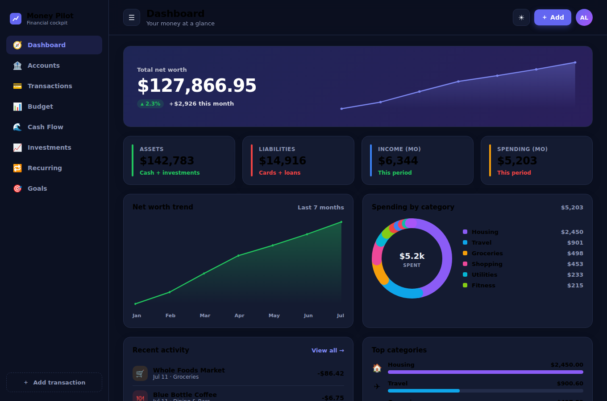

# Money Pilot ✈️💰

**Your financial cockpit** — a fully featured, interactive personal-finance UI built entirely with
[**Fable**](https://fable.io) (F# compiled to JavaScript) using the Elmish (Model-View-Update)
architecture and [Feliz](https://github.com/Zaid-Ajaj/Feliz) for the view layer.

Money Pilot takes cues from the best personal-finance apps out there — Copilot Money, Monarch Money,
and YNAB — and brings the highlights together in one polished, single-page cockpit.



## Features

Eight fully interactive sections, all driven by a single Elmish state store:

| Section | What it does |
| --- | --- |
| **Dashboard** | Net-worth hero with trend chart, asset/liability/income/spend tiles, spending donut, top categories, recent activity, upcoming bills. |
| **Accounts** | Net-worth band (assets vs. liabilities), accounts grouped by type; click any account to jump to its filtered transactions. |
| **Transactions** | Live search across merchant/note/category, filter by category & account, sort by date/amount, "to review" filter, inline re-categorization, mark-reviewed, delete, and live inflow/outflow/net totals. |
| **Budget** | Adjustable per-category budgets (spent is computed live from your transactions), donut summary, over-budget warnings, and ± steppers to tune each limit. |
| **Cash Flow** | Income-vs-spending grouped bars, savings-rate stats, net-savings trend, and a monthly breakdown waterfall. |
| **Investments** | Portfolio value hero + allocation donut, holdings with gain/loss, allocation bars, and a cost-basis/return summary. |
| **Recurring** | Bills, subscriptions & paychecks normalized to a monthly figure, with a subscription watch cloud. |
| **Goals** | Savings goals with progress rings and one-tap contributions that update live. |

Plus: **light / dark theme** toggle, an **Add transaction** modal that updates balances and budgets in real
time, toast notifications, a collapsible sidebar, and a responsive layout. Every chart (donut, area/line,
grouped bars, ranked bars, sparkline) is **hand-drawn SVG in F#** — zero JavaScript charting dependencies.

## Tech stack

- **[Fable](https://fable.io) 4** — F# → JavaScript compiler
- **[Feliz](https://github.com/Zaid-Ajaj/Feliz)** — type-safe React DSL for F#
- **[Elmish](https://elmish.github.io/elmish/)** + **Feliz.UseElmish** — Model-View-Update state management
- **[Vite](https://vitejs.dev)** — bundling & dev server
- **React 18** — runtime (via Feliz)

## Prerequisites

- [.NET SDK 8](https://dotnet.microsoft.com/download) (provides `dotnet`)
- [Node.js 18+](https://nodejs.org) (provides `npm`)

## Getting started

```bash
cd money-pilot

# restore the Fable tool + npm packages
dotnet tool restore
npm install

# compile F# with Fable and launch the Vite dev server (hot reload)
npm start
```

Then open the URL Vite prints (default <http://localhost:5173>).

### Production build

```bash
npm run build      # Fable compile -> Vite build, output in ./dist
npx vite preview   # serve the built bundle
```

## Project layout

```
money-pilot/
├── App.fsproj              # F# project + package references
├── index.html              # app shell (loads ./build/src/App.js)
├── styles.css              # design system (light + dark themes)
├── vite.config.js
└── src/
    ├── Format.fs           # currency / date / percentage formatting
    ├── Types.fs            # domain model (Account, Transaction, Budget, Goal, …)
    ├── Data.fs             # realistic seed data
    ├── Charts.fs           # hand-drawn SVG charts
    ├── State.fs            # Elmish Model / Msg / init / update
    ├── App.fs              # root component + React mount
    └── Views/              # one module per section + shared chrome
        ├── Shared.fs       # sidebar, top bar, cards, modal, toast
        ├── Dashboard.fs  Accounts.fs  Transactions.fs  Budget.fs
        └── CashFlow.fs  Investments.fs  Recurring.fs  Goals.fs
```

## Verifying it works

`verify.mjs` is a Playwright smoke test that loads the built app, walks every page, exercises the
key interactions (search, add transaction, budget steppers, goal contributions, theme toggle) and
asserts there are no console errors.

```bash
npm run build
npx vite preview --port 4173 &
node verify.mjs          # set CHROME_PATH to use a specific Chromium binary
```

All data lives in memory and is fully editable at runtime — no backend required.
